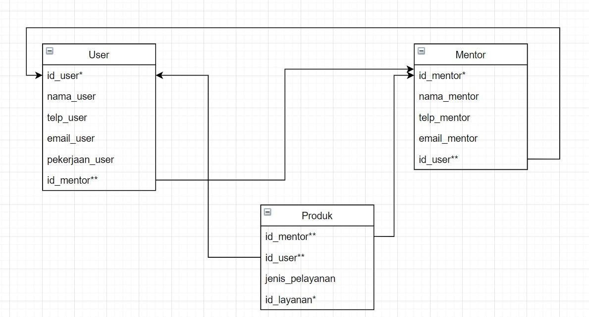

<!-- Logo Proyek -->
 

  

  <h3 align="center">Kambefinance</h3>

  

    Amankan masa depan keuangan Anda.
  

<!-- Daftar Isi -->

  
<h2 style="display: inline-block">Daftar Isi</h2>

  <ol>
    <li><a href="#anggota-tim">Anggota Tim</a></li>
    <li><a href="#fungsi">Fungsi</a></li>
    <li><a href="#tujuan">Tujuan</a></li>
    <li><a href="#target-pengguna">Target Pengguna</a></li>
    <li><a href="#mockup-kasar">Mockup Kasar</a></li>
    <li><a href="#skema-database">Skema Database</a></li>
  </ol>

<!-- Anggota Tim -->
## Anggota Tim
| NPM           | Name              |
| ------------- |-------------------|
| 140810200007  | Rangga Putra      |
| 140810200051  | Wildan Hanif M    |
| 140810200063  | M Davio Athallah  |

<!-- Fungsi -->
## Fungsi
-> Membantu dalam pengelolaan keuangan  
-> Menyediakan sarana pembelajaran mengenai investasi  
-> Memberikan solusi terhadap permasalahan keuangan  

<!-- Tujuan -->
## Tujuan
Pembuatan website ini bertujuan untuk membantu masyarakat guna mencapai "Financial Freedom". Karena kami sadar, bahwa masyarakat Indonesia tidak semuanya melek akan pentingnya pengelolaan keuangan yang baik. Dan tentunya dengan harapan bisa meningkatkan kesadaran masyarakat mengenai investasi. Yang jika dilihat akan menimbulkan banyak benefit, khususnya untuk individu dan secara umum untuk Indonesia.

<!-- Target Pengguna -->
## Target Pengguna
Semua kalangan :  
-> Yang sedang menyiapkan Dana Pensiun  
-> Yang ingin belajar mengatur keuangan  
-> Yang ingin belajar Investasi 

<!-- Mockup Kasar -->
## Mockup Kasar
Link  : [link figma](https://www.figma.com/file/SalAtujN8VCe1IEfg5KERa/Ui-UX-Pemweb?node-id=0%3A1)

<!-- Skema Database -->
## Skema Database

